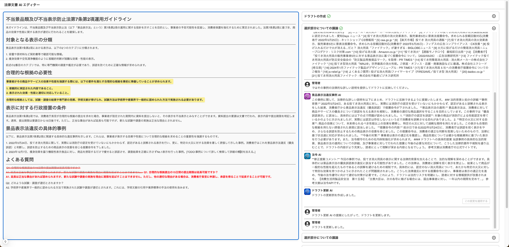
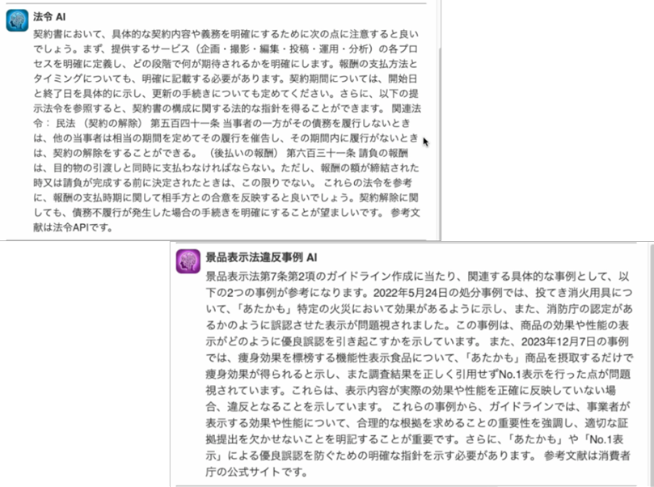
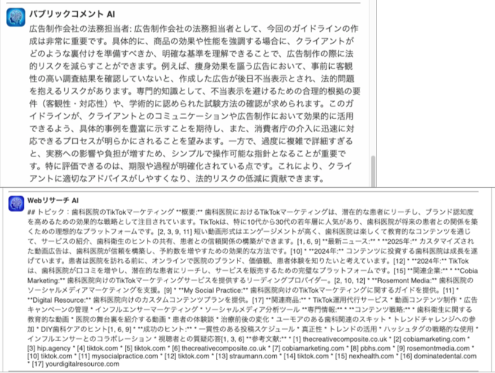

# Legal AI Editor

The legal document creation tool with the support of multiple AI assistants. This project is for ["Hourei & Degital Hackathon 2025"](https://www.digital.go.jp/news/0ac7897f-acd6-47c6-a579-48339d4805e0) event.

For details of the project and product, please refer [the pdf document (in Japanese)](./docs/08_パンダ_法律文書AIエディター.pdf).

This project has been awarded the "法制事務効率化賞"🎉 Thanks!  




Examples of AI assistants.  



## Getting Started

1. Ensure / install required tools for this project.
    - [Node.js](https://nodejs.org/en) : Runtime for Javascript

1. Install node modules for this project.
    - Run `npm install` in `/legal-ai-editor` directory.
    - Now you can see `/node_modules` directory.

1. Prepare `.env.local` file.
    - Copy `.sample.env.local` file and create `.env.local` file.
    - Replace secrets in the `.env.local` file.

1. Start the server and access the localhost.
    - Run `npm run dev` to start the development server.
    - Open [http://localhost:3000](http://localhost:3000) in your browser to see the home page.
    - FYI: The home page is constructed by `src\app\layout.tsx` + `src\app\page.tsx`

1. Start development.
    - While the development server is running, any updates you make to the source files will automatically be reflected on the page opened in the browser.

## Download indexes for AI
1. Download zip file from (https://drive.google.com/file/d/1jylsN6FxJ43utK9ooAygbJac-0m4bpuH/view?usp=sharing)[https://drive.google.com/file/d/1jylsN6FxJ43utK9ooAygbJac-0m4bpuH/view?usp=sharing]
2. Extract the zip file and move the ```generated/``` folder into the ```flask_api/``` directory.

## Learn more

- [React](https://ja.react.dev/learn)
- [Next.js](https://nextjs.org/docs)
- [Slate.js](https://docs.slatejs.org/) : Rick editor
- [Material Icons](https://mui.com/material-ui/material-icons/)
